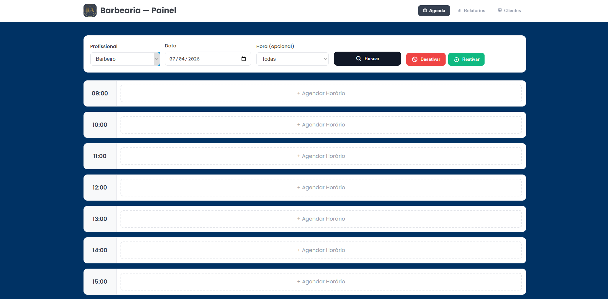

# ⚙️ ADM Barber - Dashboard de Gerenciamento

> Sistema administrativo desenvolvido para gestão de barbearias, focado em controle de agendamentos, métricas e organização operacional.

## 🔗 Demonstração
**Veja o projeto online:** [Acesse aqui](https://adm-barber.vercel.app/)

---

## 💻 Sobre o Projeto
O **ADM Barber** é uma interface de gerenciamento que permite ao administrador visualizar e controlar as atividades da barbearia. Diferente das landing pages convencionais, este projeto focou em **UI (User Interface) funcional**, com uma estrutura de dashboard que organiza informações complexas de forma clara e acessível.

## 🛠️ Tecnologias Utilizadas
- **HTML5:** Estrutura de dados e formulários.
- **CSS3:** Estilização de componentes de dashboard (cards, tabelas e menus laterais).
- **JavaScript:** Lógica para controle de estados e interatividade do sistema.
- **Vercel:** Deploy e hospedagem.

## 🎨 Diferenciais Técnicos
- **Interface Funcional:** Design focado em produtividade e rapidez no gerenciamento de dados.
- **Visual "Gamer" Profissional:** Estética moderna com temas escuros, seguindo a identidade visual do setor de barbearia atual.
- **Layout Adaptável:** Organização de elementos que mantém a usabilidade em diferentes resoluções.

## 📸 Preview

---
### 👨‍💻 Contato
**Matheus Rodrigues** [LinkedIn](https://www.linkedin.com/in/matheus-rodrigues-4398423b9) | [GitHub](https://github.com/mathrodriguesdev-arch)
